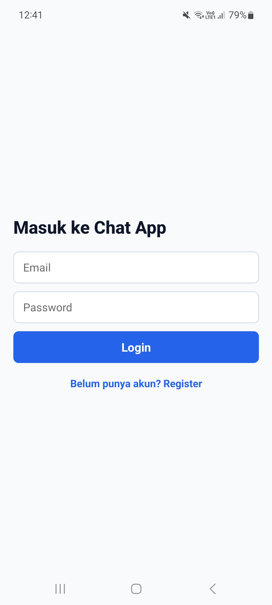
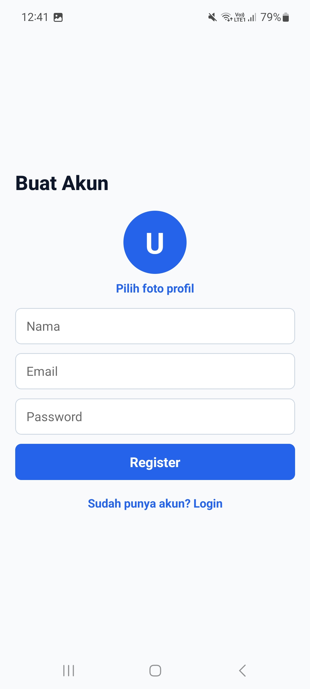
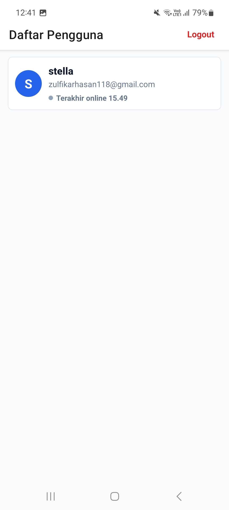

# My Chat App

## Informasi Mahasiswa
- **Nama** : Zulfikar Hasan  
- **NIM** : 2410501016  
- **Kelas** : B  

---

## Deskripsi
My Chat App adalah aplikasi chat sederhana berbasis React Native dan Expo dimana pengguna bisa melakukan register, login, melihat daftar pengguna, 
dan mengirim pesan secara realtime. Aplikasi ini menggunakan Firebase untuk autentikasi, penyimpanan data chat, status pengguna (online/offline), dan foto profil.

---

 ## Dependencies utama :

- Firebase
- React Navigation
- Async Storage
- Expo Image Picker
- React Native Safe Area Context
- React Native Screens

---

## Fitur yang dikemabngakan
- Register dan login menggunakan Firebase Authentication
- Menampilkan daftar pengguna dari Firestore
- Chat pribadi antar pengguna secara realtime
- Menyimpan pesan ke Firebase Firestore
- Menampilkan bubble chat berbeda untuk pesan sendiri dan pesan lawan bicara
- Upload foto profil menggunakan Expo Image Picker 
- Persistensi login menggunakan Async Storage
- **Indikator online/offline menggunakan Firestore**


---

## Screenshot Preview

<p>
  
  
  
  
</p>

## Cara Menjalankan

Aplikasi ini menggunakan **Expo** dan **Firebase**.

### 1. Clone Repository
```bash
git clone <URL_REPOSITORY>
```

### 2. Masuk Ke Folder Project
```bash
cd my-chat-app
```

### 3. Install Dependencies
```bash
npm install
```

### 4. Register Firebase
```bash
Daftarkan akun ke firebase untuk membuat .env
```

### 5. Jalankan Aplikasi
```bash
npx expo start
```
